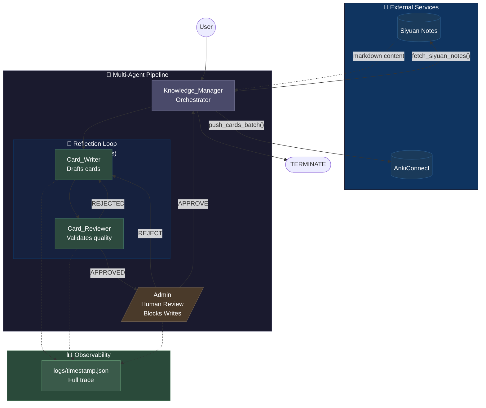

# Autonomous Local Knowledge to Anki Pipeline

A **multi-agent AI system** that extracts knowledge from [Siyuan Notes](https://b3log.org/siyuan/) and generates optimized [Anki](https://apps.ankiweb.net/) flashcards using [Microsoft AutoGen](https://microsoft.github.io/autogen/).

> **Privacy-First**: Runs entirely locally using Ollama with GPU acceleration. No data leaves your machine.


## Architecture Decisions

This pipeline demonstrates **production-grade agentic design patterns** with explicit tradeoffs. All architectural decisions are enforced in code, not just in prompts.

### 1. Code-Driven Routing (Deterministic State Machine)

```
User → Knowledge_Manager → Card_Writer → Card_Reviewer → Admin → [loop or save]
```

Agent handoffs use a **`selector_func` state machine** rather than LLM-chosen routing:

- **Why**: Makes control flow testable, auditable, and free of inference cost on orchestration decisions
- **Tradeoff**: Less flexible if you need dynamic agent selection, but vastly simpler debugging
- **Implementation**: `agents.py` contains the routing logic as pure Python, not hidden in prompts

### 2. Reflection Loop with Rejection Guardrail

The **Card_Reviewer → Card_Writer feedback loop** automatically runs until cards pass quality checks:

- **Why**: Iterative refinement catches obvious failures (lists, verbose answers) without human input
- **Guardrail**: Loop caps at **2 rejections** before escalating to human review
- **Why the cap**: Prevents runaway rewrites and model-specific failure modes (e.g., smaller models stuck in loops)
- **Implementation**: Guardrail enforced in `selector_func`, not just in prompts — a code guarantee, not a hope

### 3. Human-in-the-Loop Before Writes

No card reaches Anki without an explicit terminal `APPROVE`:

- **Why**: Writes to Anki have side effects that **can't be safely retried** (duplicates, wrong deck, etc.)
- **Admin gate**: `UserProxyAgent` with human input (`input()` prompt) — blocks any downstream tool calls
- **Implementation**: Writes only trigger after Admin's explicit approval in `main.py`

### 4. Tool Use for External Integration

Agents call **`fetch_siyuan_notes()`** and **`push_cards_batch()`** for external systems:

- **Why**: Separates orchestration (agent logic) from I/O (API calls) — testable and reusable
- **Privacy-first**: Content stays local; only tool-specific data leaves your machine
- **Error handling**: Tools return human-readable errors, not stack traces, for agent readability

### 5. Structured Observability via Logging

Each run writes a **`logs/{timestamp}.json`** file with full execution trace:

**Implementation** (`logger.py`):
```python
class PipelineLogger:
    def log_agent_message(agent: str, content: str, type: str) -> None
    def log_tool_call(agent: str, tool: str, input: dict, result: str) -> None
    def log_rejection(reason: str) -> None  # Increments rejection_count, triggers guardrail at 2
    def save() -> Path  # Writes timestamped JSON file to logs/
```

**Example log entry:**
```json
{
  "timestamp": "2026-05-12T14:24:12.345678",
  "agent": "Card_Reviewer",
  "type": "rejection",
  "reason": "Back has multiple answers (violates MIP)",
  "rejection_count": 1,
  "guardrail_active": false
}
```

**Why this matters:**
- **Debugging**: Trace exactly what each agent said and why
- **Auditing**: Verify the decision path before cards were written to Anki
- **Guardrails**: See when rejection caps (2) triggered human escalation
- **Portfolio**: Shows you understand that "if it happened, it should be logged" (production best practice)

## Features

- **Quality-First Card Generation**: Cards follow [SuperMemo's 20 Rules](https://supermemo.guru/wiki/20_rules_of_knowledge_formulation) (Minimum Information Principle)
- **Iterative Refinement**: Reviewer agent sends cards back for revision until they pass quality checks
- **Human Oversight**: Final approval step before cards are pushed to Anki
- **Local-First**: Works with Ollama or any OpenAI-compatible LLM server - no cloud API keys required
- **GPU Acceleration**: Ollama 0.17+ supports Intel Arc, NVIDIA, and AMD GPUs
- **Structured Logging**: JSON traces of every run for debugging and auditing

## Architecture Diagram



**Execution Flow:**
1. **Knowledge_Manager** orchestrates the pipeline and fetches notes from Siyuan
2. **Card_Writer** creates flashcards following the Minimum Information Principle
3. **Card_Reviewer** validates quality → auto-rejects poor cards (max 2 times, then escalates)
4. **Admin** (you) provides final approval → blocks cards from reaching Anki without explicit OK
5. **Knowledge_Manager** only calls `push_cards_batch` after Admin approval
6. **Logging** traces every decision for auditing and debugging

## Quick Start

### Prerequisites

- **Python 3.13+**
- **[Ollama](https://ollama.com/)** - Local LLM inference (0.17+ recommended for Intel GPU support)
- **Siyuan Notes** with API enabled
- **Anki** with [AnkiConnect](https://ankiweb.net/shared/info/2055492159) plugin

### Installation

```bash
# Clone the repository
git clone https://github.com/ronketer/siyuan-to-anki.git
cd siyuan-to-anki

# Create virtual environment (using uv)
uv venv
.venv\Scripts\activate  # Windows
# source .venv/bin/activate  # Linux/Mac

# Install dependencies
uv sync
```

### Configuration

```bash
# Copy the example environment file
cp .env.example .env

# Edit .env with your settings
notepad .env  # or your preferred editor
```

Required settings:
- TARGET_BLOCK_ID: The Siyuan block ID containing your notes

### Usage

1. Start Ollama and pull a model:
   ```bash
   ollama serve  # if not already running
   ollama pull qwen3.5:4b  # recommended for function calling
   ```
2. Start Siyuan Notes
3. Start Anki (with AnkiConnect running)
4. Run the pipeline:

```bash
python main.py
```

> **Intel GPU Users**: Ollama 0.17+ automatically detects Intel Arc/Iris GPUs and uses Vulkan acceleration. No extra setup needed!

## Project Structure

```
.
+-- main.py                      # Entry point with logging integration
+-- logs/                         # Execution traces (JSON per run)
+-- src/
|   +-- anki_pipeline/
|       +-- __init__.py
|       +-- agents.py            # Agent definitions and deterministic routing
|       +-- config.py            # Environment configuration
|       +-- logger.py            # Structured logging for observability
|       +-- models.py            # Pydantic models for structured output
|       +-- tools.py             # Siyuan and Anki API integrations
+-- pyproject.toml               # Dependencies and project metadata
+-- .env.example                 # Example environment configuration
+-- README.md
```

## Observability & Debugging

Every pipeline run produces a **`logs/{timestamp}.json`** file with a complete execution trace:

```json
{
  "run_id": "2026-05-12T14:23:45.123456",
  "entries": [
    {
      "timestamp": "2026-05-12T14:23:45.234567",
      "agent": "Card_Reviewer",
      "type": "rejection",
      "reason": "Back has multiple answers (violates MIP)",
      "rejection_count": 1
    },
    {
      "timestamp": "2026-05-12T14:24:12.345678",
      "agent": "Admin",
      "type": "approval",
      "card_count": 8
    }
  ]
}
```

**Why this matters:**
- **Debugging**: Trace exactly what each agent said and why
- **Auditing**: Verify the decision path before cards were written
- **Guardrails**: See when rejection caps triggered human escalation
- **Portfolio**: Shows production-aware design (observability is not optional)

## Flashcard Quality Standards

Cards are validated against [SuperMemo's 20 Rules of Formulating Knowledge](https://www.supermemo.com/en/blog/twenty-rules-of-formulating-knowledge):

1. **Minimum Information Principle**: One fact per card
2. **No Sets**: Avoid asking for lists of items
3. **Cloze Format**: Use fill-in-the-blank for complex facts
4. **Clean Text**: No formatting artifacts or tags

## LLM Configuration

### Model Requirements

This pipeline requires a model with **strong instruction-following** capabilities to properly execute multi-agent workflows. Smaller models (< 4B parameters) may skip agents or ignore the reflection loop.

### Ollama (Recommended)

Best for local inference with GPU acceleration:

```env
LLM_BASE_URL=http://127.0.0.1:11434/v1
LLM_MODEL_ID=qwen3:4b
```

> ⚠️ **Model Size Warning**: Models smaller than ~4B parameters may not follow multi-agent workflows correctly. They tend to skip agents, ignore the reflection loop, or call tools with placeholder values. Use 4B+ parameter models for reliable results.

### OpenAI (Cloud)

```env
LLM_BASE_URL=https://api.openai.com/v1
LLM_MODEL_ID=gpt-4o-mini
LLM_API_KEY=sk-your-api-key
```

### Other OpenAI-Compatible Servers

Works with LM Studio, vLLM, or any server exposing `/v1/chat/completions`:

```env
LLM_BASE_URL=http://127.0.0.1:YOUR_PORT/v1
LLM_MODEL_ID=your-model-name
```

## Security Considerations

- **No credentials in code**: All secrets loaded from environment variables
- **Local inference**: Default configuration keeps all data on your machine
- **No sensitive data in prompts**: Knowledge content stays within local network
- **Token-based auth**: Siyuan API uses local token authentication

## Technologies

- [AutoGen 0.4+](https://microsoft.github.io/autogen/) - Multi-agent orchestration
- [Pydantic](https://docs.pydantic.dev/) - Data validation and structured output
- [Ollama](https://ollama.com/) - Local LLM inference with GPU acceleration (Intel, NVIDIA, AMD)
- [Siyuan Notes](https://b3log.org/siyuan/) - Local-first knowledge management
- [AnkiConnect](https://ankiweb.net/shared/info/2055492159) - Anki automation API

## License

MIT License - see [LICENSE](LICENSE) for details.
